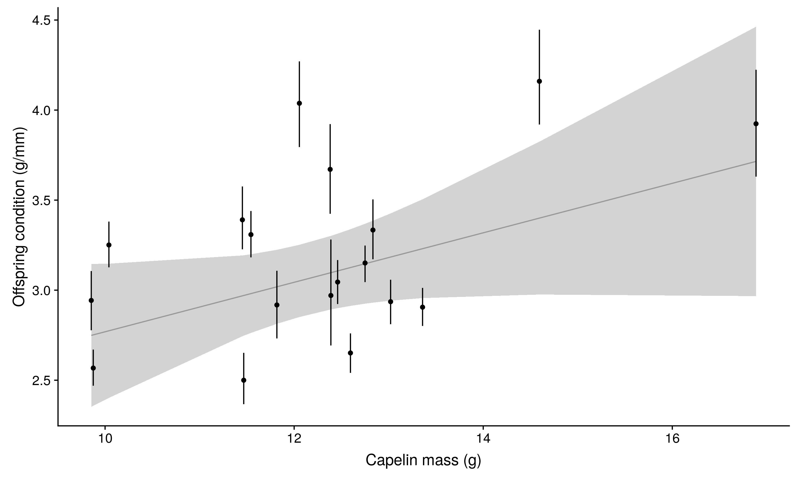

```{r setup, include=FALSE}
knitr::opts_chunk$set(echo = TRUE)
# library(flextable)
# library(officer)
options(scipen = 999)
```


https://github.com/KeithLewis99/capelin-murres/blob/master/reports/ChickCondition_f_CapelinMass_word.docx


A reviewer asked us to analyze murre chick condition as a fucntion of capelin mass   
This analysis would assume that higher capelin mass in the deliveries would be directly reflected in higher chick condition       

I carried out this analysis identically to the other analyses, i.e. using a regression of the annual means of chick condition as a function of the mean of capelin mass,  weighted by the inverse of the variance of the annual measurements of chick condition       
Parameter estimates are presented with 95% confidence intervals; trends are considered significant if 95% confidence intervals do not bound zero.      


Estimate of the slope `r  round(coef(chick_cap_mod)[[2]],2)`, 95% CI: 
`r round(confint(chick_cap_mod)[2,1],2)` -- `r round(confint(chick_cap_mod)[2,2],2)`
      


There is a positive relationship, however it is not significant (the 95% CI of the estimate of the slope bounds zero). It is very close to being significant, so one may report it as a positive trend.
THere are a few issues:    
  * one data point (the largest capelin mass) has a lot of leverage in this relationship    
  * there is a lot of variation in chick condition at intermediate values of capelin mass.    
  
  
This may be due becuase the assumption of a direct translation of high capelin mass into high chick condition may not be met, as this mechanism is also mediated by mean number of prey deliveries, and the assimilation of energy from the prey into bird tissue.      
I am sure I am missing things, as it is late and I may not be thinking this through, but in gereneal terms I think that we are not capturing the relationship well because both metrics are inherently very noisy. THe relationships are better captured individually as functions of year, as these do not have error in the x-axis, i.e. year is measured without error.
